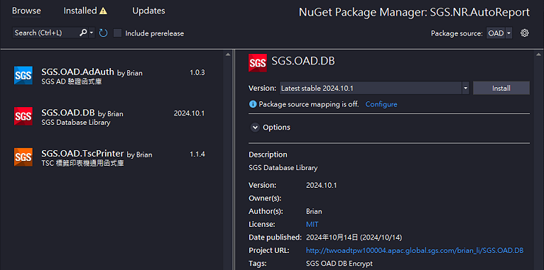
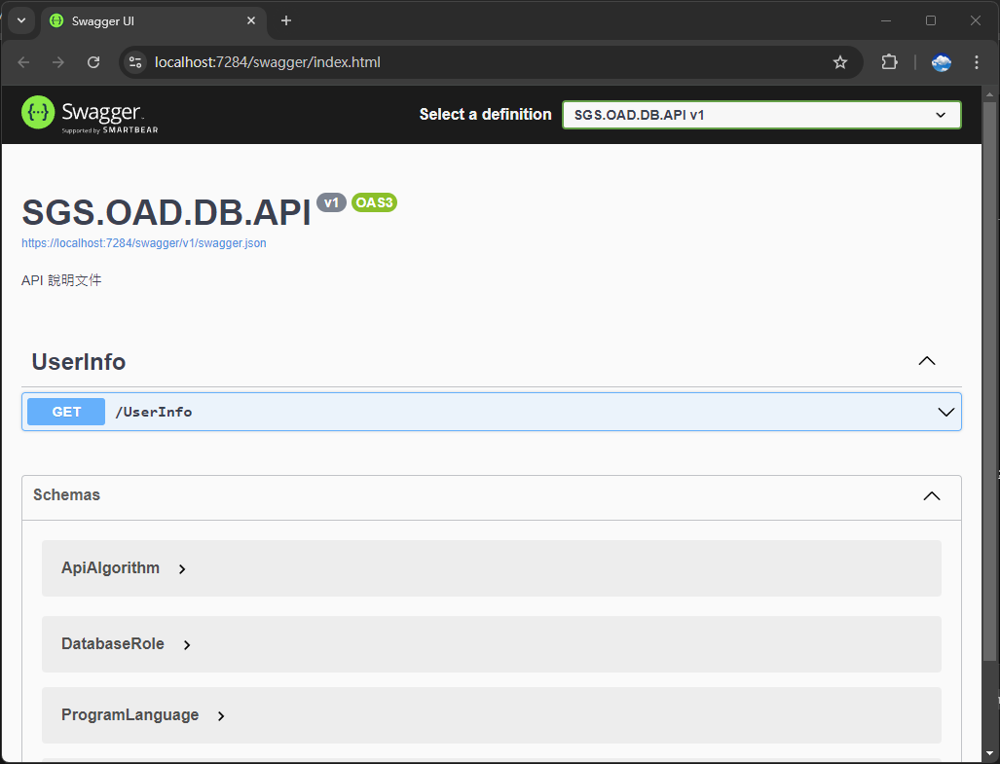
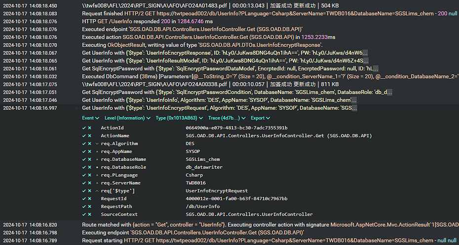

 
 


 


- 主要由前後端兩個專案組成
- 前端 `SGS.OAD.DB` 為 Class Library，讓其他專案引用並取得連線字串
- 後端 `SGS.OAD.DB.API` 為 WebAPI，接收前端要求並回傳加密資料

>💡詳細完整文件請參考儲存庫 Wiki

# 📦SGS.OAD.DB

`SGS.OAD.DB` 部署為 NuGet Package，可透過 NuGet Package Manager 進行安裝



## 🛠️How to Use

```cs
using SGS.OAD.DB;

// a quick start to getting the connection string
var connectionString = DbInfoBuilder
    .Init()                 // 1. initialize builder
    .SetServer("TWDB000")   // 2. set server name
    .SetDatabase("SGSLims") // 3. set database name
    .Build()                // 4. build DbInfo data object
    .ConnectionString;      // 5. get your connection string ❤️
```

## 👥Use Cases

Wiki 文件中闡述了多種使用情境，包括

- 特殊權限帳號取得
- 其他連線設定
- 設定後端服務端點
- 服務實作與注入
- 非同步處理

>💡請點選儲存庫 Wiki 文件詳細了解各種使用情境

# 🌐SGS.OAD.DB.API

- `SGS.OAD.DB.API` 部署後負責接收網路要求並回傳加密資料
- 可使用 Swagger UI 測試：https://twws006.sgs.net/db/swagger

## Swagger

`Swagger` 是一種 API 文件工具，可生成互動式的 API 文件，方便測試和理解 API 的使用方法



## Seq

`Seq` 是一種日誌管理工具，可收集、儲存和分析應用程式的 log。它支援結構化，並提供搜尋和篩選功能



# 📋TODO

- 實作 DES 加密服務
- 實作 AES 加密服務
- 實作 AES 解密服務
- 前端歷程記錄
- 後端快取服務
- 開發管理工具
- 使用混淆器